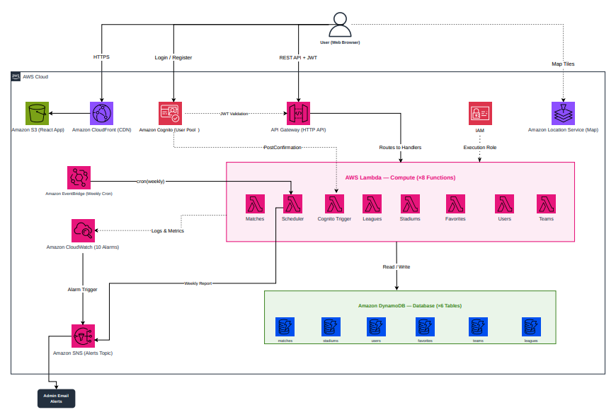

# Tribunet — Israeli Football Match Platform

A serverless web platform for football fans in Israel. Browse upcoming matches on an interactive map, filter by league or team, save favorites, and buy tickets — all powered by AWS.

**Live Demo:** [https://d3qx6x8ydteha.cloudfront.net](https://d3qx6x8ydteha.cloudfront.net/login)


---

## Authors

<div align="center">
  <table>
    <tr>
      <td align="center" style="padding: 20px 30px; border: 1px solid #30363d; border-radius: 8px;">
        <b>Roy Meoded</b><br>
        <sub>Computer Science Student &amp; Developer</sub><br><br>
        <a href="https://github.com/roy3177">
          
        </a><br><br>
        <a href="https://www.linkedin.com/in/roy-meoded/">
          
        </a><br><br>
        <a href="mailto:roymeoded2512@gmail.com">
          
        </a>
      </td>
      <td align="center" style="padding: 20px 30px; border: 1px solid #30363d; border-radius: 8px;">
        <b>Tomer Gal</b><br>
        <sub>Computer Science Student &amp; Developer</sub><br><br>
        <a href="https://github.com/OliveKodo">
          
        </a><br><br>
        <a href="https://www.linkedin.com/in/tomer-gal-233045234/">
          
        </a><br><br>
        <a href="mailto:tgal40@gmail.com">
          
        </a>
      </td>
      <td align="center" style="padding: 20px 30px; border: 1px solid #30363d; border-radius: 8px;">
        <b>Yarin Keshet</b><br>
        <sub>Computer Science Student &amp; Developer</sub><br><br>
        <a href="https://github.com/yarinkash1">
          
        </a><br><br>
        <a href="https://www.linkedin.com/in/yarin-keshet-bb9541310/">
          
        </a><br><br>
        <a href="mailto:yarinkash1@gmail.com">
          
        </a>
      </td>
    </tr>
  </table>
</div>

---

## Architecture



---

## Tech Stack

| Layer | Technology |
|---|---|
| Frontend | React 18, Vite, Framer Motion, Tailwind CSS |
| Backend | AWS Lambda (Python 3.13) — 8 functions |
| API | Amazon API Gateway (HTTP API + JWT auth) |
| Database | Amazon DynamoDB — 6 tables |
| Auth | Amazon Cognito (User Pool + JWT) |
| Hosting | Amazon S3 + CloudFront |
| Map | Amazon Location Service (Esri style) |
| Monitoring | CloudWatch (10 alarms) + SNS email alerts |
| Scheduling | EventBridge (weekly cron — Sunday 7:00 UTC) |
| IaC | AWS SAM (CloudFormation) |

---

## Project Structure

```
Tribunet/
├── frontend/                  # React 18 + Vite application
│   ├── src/
│   │   ├── pages/             # 10 pages (Home, Map, Login, Admin, etc.)
│   │   ├── components/        # Reusable UI components
│   │   ├── context/           # Auth + Toast context (Cognito integration)
│   │   ├── services/          # Axios HTTP client with JWT interceptor
│   │   ├── hooks/             # Custom React hooks
│   │   └── animations/        # Framer Motion animation variants
│   ├── .env.example           # Environment variable template
│   └── package.json
│
├── backend/                   # Python Lambda functions
│   ├── functions/             # 8 Lambda handlers (matches, stadiums, users, etc.)
│   ├── shared/                # Shared modules: auth.py, db.py, response.py
│   ├── tests/                 # 140 pytest unit tests
│   └── requirements.txt
│
├── infrastructure/            # AWS infrastructure
│   ├── sam-template.yaml      # CloudFormation (API GW, Lambda, DynamoDB, IAM, CloudWatch)
│   ├── samconfig.toml         # SAM deployment config
│   ├── deploy.ps1             # Unified deployment script (build + deploy + seed)
│   ├── add_leagues.py         # Seed: 7 Israeli football leagues
│   └── add_teams.py           # Seed: 26 Israeli football teams

```

---

## API Overview

Base URL: `https://XXXXXXXXXX.execute-api.us-east-1.amazonaws.com/prod`

| Method | Endpoint | Auth | Description |
|---|---|---|---|
| GET | `/matches` | Public | List all matches |
| GET | `/matches/{id}` | Public | Get match by ID |
| POST | `/matches` | Admin | Create match |
| PUT | `/matches/{id}` | Admin | Update match |
| DELETE | `/matches/{id}` | Admin | Delete match |
| GET | `/stadiums` | Public | List all stadiums |
| POST | `/stadiums` | Admin | Create stadium |
| PUT | `/stadiums/{id}` | Admin | Update stadium |
| DELETE | `/stadiums/{id}` | Admin | Delete stadium |
| GET | `/teams` | Public | List all teams |
| GET | `/leagues` | Public | List all leagues |
| GET | `/favorites` | User | Get user's favorites |
| POST | `/favorites/{id}` | User | Add match to favorites |
| DELETE | `/favorites/{id}` | User | Remove from favorites |
| GET | `/users/me` | User | Get own profile |
| PUT | `/users/me` | User | Update own profile |
| GET | `/users` | Admin | List all users |
| DELETE | `/users/{id}` | Admin | Delete a user |

Full Swagger documentation: [docs/swagger.yaml](docs/swagger.yaml)


---

## Running Tests

```bash
cd backend
pip install pytest boto3
pytest tests/ -v
```

140 unit tests covering all Lambda handlers and shared modules.

---


*Built as a final academic project demonstrating production-grade AWS Serverless architecture.*
